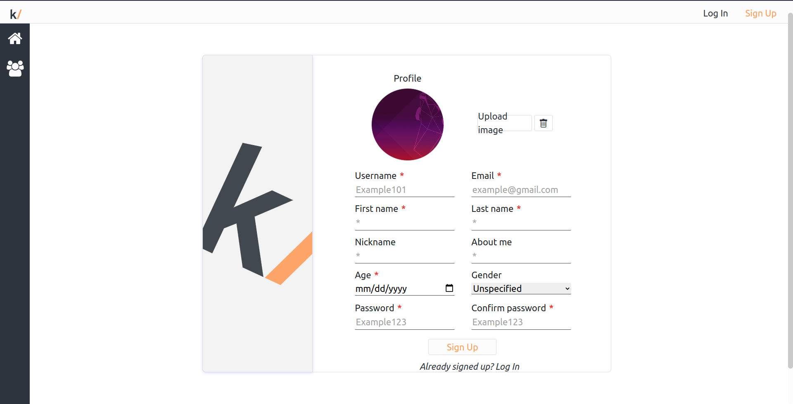
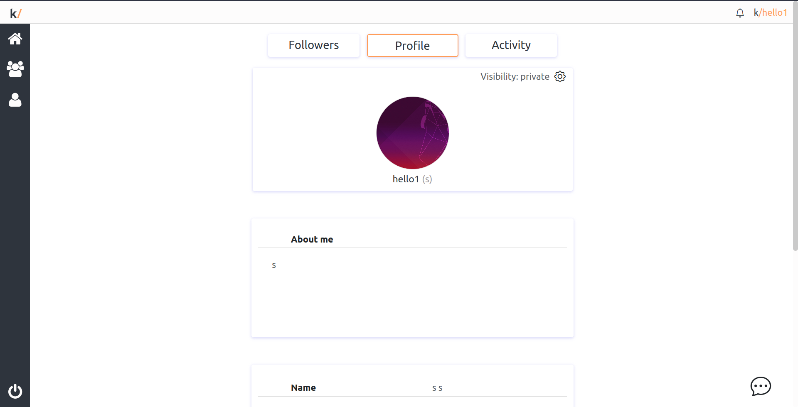
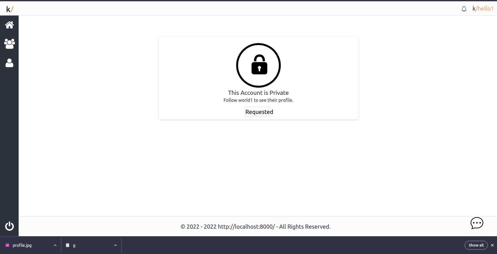
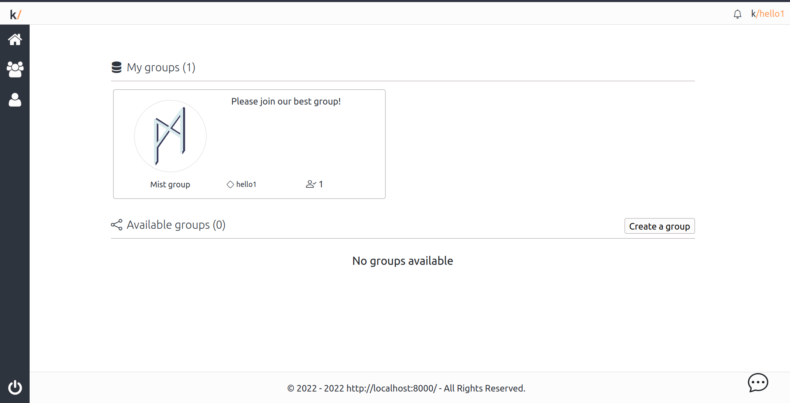
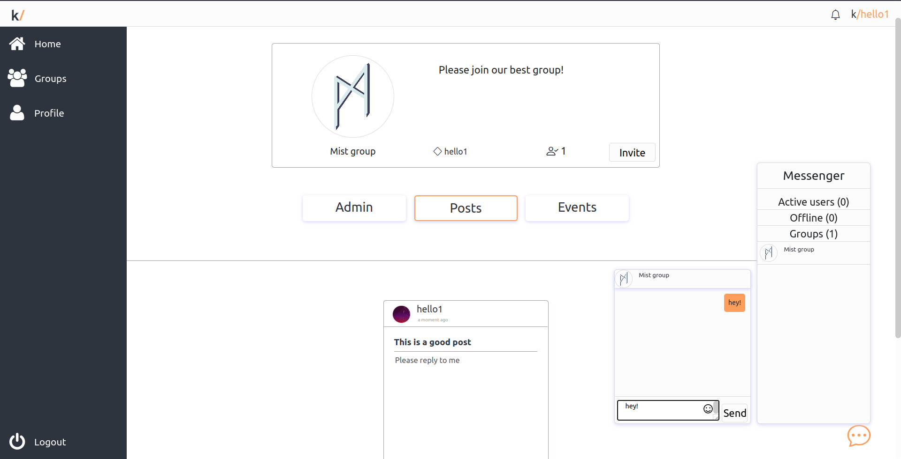
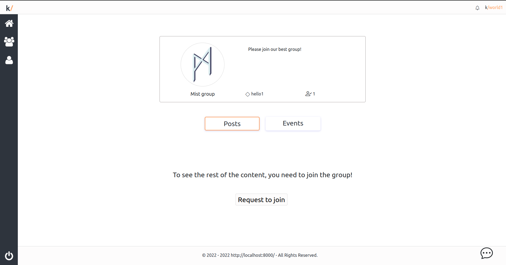

# vue-forum

## Table of Contents
- [vue-forum](#vue-forum)
  - [Table of Contents](#table-of-contents)
  - [General Information](#general-information)
  - [Features](#features)
  - [Technologies Used](#technologies-used)
  - [Team \& My Work](#team--my-work)
  - [Main Learnings](#main-learnings)
  - [Setup](#setup)
  - [Images](#images)

## General Information
This project was made as a school project in [kood/Jõhvi](https://kood.tech/) (13.08.2022)

We had to create a forum using a framework.

  **NB! Different source control platform was used hence no commit history.**


## Features
- Posts
- Likes
- Profiles
- Groups & group chats
- Notifications
- Post types
- Image upload
- Followers

## Technologies Used

[JavaScript](https://www.javascript.com/)

[Vue.js](https://vuejs.org/)

[Golang](https://go.dev/)

[Sqlite](https://www.sqlite.org/index.html)

[SQL](https://en.wikipedia.org/wiki/SQL)

[Docker](https://www.docker.com/)

[Axios](https://axios-http.com/)

[Bootstrap 5](https://getbootstrap.com/)

[Express](https://expressjs.com/)

[jQuery](https://jquery.com/)

[lodash](https://lodash.com/)

[Vue3-emoji-picker](https://www.npmjs.com/package/vue3-emoji-picker?activeTab=explore)


## Team & My Work
In this project I was in a team of 4 with 3 other students from kood/Jõhvi.

I was responsible for:
- Being a project manager
- Designing UI/UX
- Containerizing the application
- Designing the database
- Creating both the frontend and server side

## Main Learnings
- Pull Requests and branching using source control
- Reusable code is the way to go *(I have to admit this was a chaotic spagett...)*.
- Vue.js framework basics
- SQL Basics
- Bootstrap 5 basics
- CRUD API

## Setup
Clone the repository
```
git clone https://github.com/JesusKris/vue-forum.git
```
Run the build script to containerize
```
chmod +x dockerbuild.sh

./dockerbuild.sh
```
## Images





